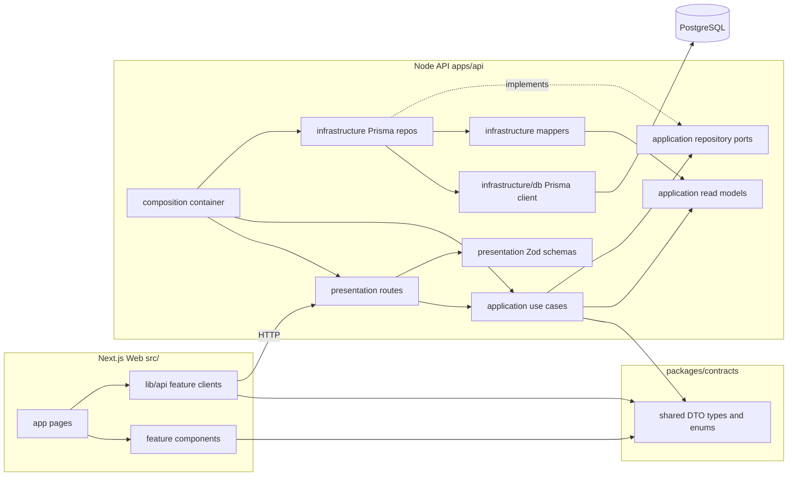

# Architecture

## Layer overview



## Layer rules

| Layer           | Location                                 | Responsibility                                                      |
| --------------- | ---------------------------------------- | ------------------------------------------------------------------- |
| UI              | `src/app/`, `src/features/*/components/` | Rendering only                                                      |
| Web API clients | `src/lib/api/`                           | Typed HTTP access (`applicationsApi`, `dashboardApi`)               |
| Contracts       | `packages/contracts/`                    | Shared DTO types and enums (Prisma-free)                            |
| Presentation    | `apps/api/src/presentation/`             | HTTP routes and Zod validation                                      |
| Application     | `apps/api/src/application/`              | Use cases, repository ports, read models                            |
| Infrastructure  | `apps/api/src/infrastructure/`           | Prisma client, repository implementations, mappers, JWT/bcrypt auth |
| Composition     | `apps/api/src/composition/`              | Wires dependencies (composition root)                               |
| Database        | `prisma/`                                | Schema, migrations, seed                                            |

## Dependency rules

| Layer          | May import                    | Must NOT import              |
| -------------- | ----------------------------- | ---------------------------- |
| Application    | ports, read models, contracts | Prisma, Hono, concrete repos |
| Infrastructure | Prisma, ports, read models    | Hono, routes                 |
| Presentation   | Use cases, schemas, contracts | Prisma, concrete repos       |
| Composition    | Everything                    | — (wiring edge only)         |

Domain entities are deferred until write/command use cases are added. Current endpoints are read-only (CQRS query side).

- `@prisma/client` imports only under `infrastructure/`
- Concrete repository classes only imported in `composition/`
- `packages/contracts` is the shared API boundary with the Next.js frontend

## What not to do

- No Prisma imports in `src/` (Next.js web app)
- No duplicated DTO types outside `packages/contracts`
- No business logic in `page.tsx` or route handlers
- No one-line query wrappers — use `src/lib/api/*` feature clients instead
- No singleton repository defaults — wire dependencies in `composition/container.ts`

## Environment variables

| Variable                 | App               | Purpose                                                              |
| ------------------------ | ----------------- | -------------------------------------------------------------------- |
| `DATABASE_URL`           | API               | PostgreSQL connection                                                |
| `API_PORT`               | API               | HTTP port (default `4000`)                                           |
| `API_URL`                | Web (server-only) | Base URL for server-side fetch (defaults to `http://localhost:4000`) |
| `JWT_SECRET`             | API               | Secret for signing access tokens (required)                          |
| `JWT_EXPIRES_IN_SECONDS` | API + Web         | Access token lifetime in seconds (default `604800`)                  |
| `NEXT_PUBLIC_APP_URL`    | Web + API         | Canonical app URL; also used as CORS origin by the API               |

## Authentication

- **API**: `POST /auth/login`, `POST /auth/register` (public); `GET /auth/me` and all data routes require `Authorization: Bearer <token>` or `access_token` cookie.
- **Web**: login form posts to Next.js route handlers (`/api/auth/*`) which proxy to the API and set an httpOnly `access_token` cookie on the Next.js origin.
- **Demo user** (after seed): `demo@interwjuer.app` / `demo123456`

## Local development

```powershell
pnpm dev          # starts API + Next.js
pnpm db:migrate   # apply migrations
pnpm db:seed      # seed data
```

## Deployment

Run the API and web app as separate processes. Apply migrations as a release step (`pnpm exec prisma migrate deploy`), not from request handlers.
